## Nestjs course

### What Is NestJS?

- NestJS is a widely used open-source framework that empowers developers to create robust and high-performing web applications on top of Node.js. With many powerful tools and features, NestJS is a practical framework for building scalable and maintainable web applications that meet modern development standards. NestJS uses TypeScript, an enhanced version of JavaScript that provides additional features and stricter typing to ensure improved code quality and reliability.

### NestJS architecture

```mermaid
graph TB
    subgraph NestJS[NestJS Internal Component Architecture]
        direction TB
        
        subgraph ModuleSystem[Module System - @Module Decorator]
            direction TB
            Module[Module<br/>Container for organizing code]
            ModuleImports[imports: Module dependencies]
            ModuleControllers[controllers: Route handlers]
            ModuleProviders[providers: Services & utilities]
            ModuleExports[exports: Shared providers]
            
            Module --- ModuleImports
            Module --- ModuleControllers
            Module --- ModuleProviders
            Module --- ModuleExports
        end
        
        subgraph Controllers[Controllers - @Controller Decorator]
            direction TB
            Controller[Controller<br/>TypeScript Class]
            Routes[Define Routes & Endpoints]
            RequestHandlers[Handle Incoming Requests]
            ResponseReturn[Return Responses to Client]
            
            Controller --- Routes
            Controller --- RequestHandlers
            Controller --- ResponseReturn
        end
        
        subgraph Services[Services - @Injectable Decorator]
            direction TB
            Service[Service<br/>TypeScript Class]
            BusinessLogic[Business Logic Implementation]
            DataOperations[Data Operations & Processing]
            DI[Dependency Injection System]
            
            Service --- BusinessLogic
            Service --- DataOperations
            Service --- DI
        end
        
        subgraph Pipes[Pipes - Transform Input Data]
            direction TB
            PipeComponent[Pipe]
            PipeValidation[Validation]
            PipeTransformation[Data Transformation]
            PipeScope[Applied to: routes, controllers, or app-wide]
            
            PipeComponent --- PipeValidation
            PipeComponent --- PipeTransformation
            PipeComponent --- PipeScope
        end
        
        subgraph Guards[Guards - @Injectable + CanActivate]
            direction TB
            GuardComponent[Guard<br/>TypeScript Class]
            Authentication[Authentication]
            Authorization[Authorization]
            RateLimiting[Rate Limiting]
            AccessControl[Control Access to Endpoints]
            
            GuardComponent --- Authentication
            GuardComponent --- Authorization
            GuardComponent --- RateLimiting
            GuardComponent --- AccessControl
        end
        
        subgraph Middleware[Middleware - Function/Class]
            direction TB
            MiddlewareComponent[Middleware]
            ExecuteCode[Execute Code]
            ModifyReqRes[Modify Request/Response Objects]
            EndCycle[End Request-Response Cycle]
            CallNext[Call Next Middleware]
            
            MiddlewareComponent --- ExecuteCode
            MiddlewareComponent --- ModifyReqRes
            MiddlewareComponent --- EndCycle
            MiddlewareComponent --- CallNext
        end
        
        subgraph Interceptors[Interceptors - Intercept HTTP]
            direction TB
            InterceptorComponent[Interceptor<br/>TypeScript Class]
            InterceptRequest[Intercept Incoming Requests]
            InterceptResponse[Intercept Outgoing Responses]
            Logging[Logging]
            ErrorHandling[Error Handling]
            Caching[Caching]
            ResponseTransform[Response Transformation]
            
            InterceptorComponent --- InterceptRequest
            InterceptorComponent --- InterceptResponse
            InterceptorComponent --- Logging
            InterceptorComponent --- ErrorHandling
            InterceptorComponent --- Caching
            InterceptorComponent --- ResponseTransform
        end
        
        ModuleControllers -.contains.-> Controller
        ModuleProviders -.contains.-> Service
        Controller -.injects.-> Service
        Controller -.uses.-> PipeComponent
        Controller -.protected by.-> GuardComponent
        Controller -.intercepted by.-> InterceptorComponent
        Module -.uses.-> MiddlewareComponent
    end
    
    style Module fill:#e3f2fd,stroke:#01579b,stroke-width:3px,color:#000
    style Controller fill:#fce4ec,stroke:#880e4f,stroke-width:3px,color:#000
    style Service fill:#e8f5e9,stroke:#2e7d32,stroke-width:3px,color:#000
    style PipeComponent fill:#fff3e0,stroke:#e65100,stroke-width:3px,color:#000
    style GuardComponent fill:#f3e5f5,stroke:#4a148c,stroke-width:3px,color:#000
    style MiddlewareComponent fill:#fff9c4,stroke:#f57f17,stroke-width:3px,color:#000
    style InterceptorComponent fill:#e0f2f1,stroke:#004d40,stroke-width:3px,color:#000
    
    style ModuleSystem fill:#bbdefb,stroke:#0277bd,stroke-width:2px
    style Controllers fill:#f8bbd0,stroke:#c2185b,stroke-width:2px
    style Services fill:#c8e6c9,stroke:#388e3c,stroke-width:2px
    style Pipes fill:#ffe0b2,stroke:#ef6c00,stroke-width:2px
    style Guards fill:#e1bee7,stroke:#7b1fa2,stroke-width:2px
    style Middleware fill:#fff9c4,stroke:#fbc02d,stroke-width:2px
    style Interceptors fill:#b2dfdb,stroke:#00695c,stroke-width:2px
```





- NestJS uses a ```modular architecture``` that enables developers to generate reusable code and organize individual modules for specific concerns. Here are some building blocks in NestJS:

- ```Modules```: A module is a class mark with the ```@Module() decorator```. It serves as a container for related ```controllers```, ```providers```, and other related codes. NestJS provides a powerful module system that allows developers to create ```reusable modules``` and organize their code.

- ```Controllers```: A controller is responsible for ```handling incoming requests and returning responses``` to the client. ```It is a TypeScript class annotated with the @Controller() decorator```. Controllers are used to ```define routes and endpoint handlers for the application```.

- ```Services```: In NestJS, ```a service is a TypeScript class annotated with the @Injectable() decorator```. It is responsible for handling business logic, performing data operations, and providing functionality to other parts of the application ```through the NestJS dependency injection system```.

- ```Pipes```: Pipes can be applied to ```individual route handlers```, controllers, or the entire application to ```transform input data before it is processed by a controller```, making them useful for tasks such as ```validation and transformation```.

- ```Guards```: A guard ```is a class mark with the @Injectable() decorator and implements the CanActivate interface```. NestJS applications use it to ```control access to endpoints by performing tasks such as authentication, authorization, and rate limiting```.

- ```Middleware```: Middleware functions access the request, response, and the next middleware in the stack. ```Middleware functions execute code, modify the request and response objects, end the request-response cycle```, or call the next middleware in the stack.

- Interceptors: NestJS uses interceptors as ```classes that intercept incoming HTTP requests and outgoing HTTP responses```. Interceptors handle ```logging, error handling, caching, or response transformation```.

### Nestjs request lifecycle


### Use cases
NestJS is a versatile framework that facilitates the development of various types of applications. Here are some types of applications we can build with NestJS:

- ```Real-time applications```: NestJS provides built-in support for web sockets, making it an excellent choice for developing real-time applications or live-streaming platforms.

- ```Microservices```: NestJS’s modular architecture and support for message brokers such as RabbitMQ and Kafka make it a perfect choice for building scalable and distributed microservices.

- ```API-based applications```: NestJS offers a built-in capability to develop RESTful APIs and seamlessly integrate them with popular front-end frameworks like Angular or React, making it an ideal platform for creating modern web applications.


### What we will be learning in this course ?

[] Getting started: Get introduced to NestJS and its components, and build a simple application.

[] NestJS CLI: Learn how to use the NestJS command-line interface to speed development.

[] Building a REST API: Learn how to design and develop a RESTful API using NestJS.

[] Validation and error handling: Learn how to validate data and handle errors in your application.

[] Working with databases: Understand how to use TypeORM for database interactions.

[] App configuration: Manage different application settings and configurations.

[] Authentication: Implement user authentication using JSON Web Tokens (JWTs).

[] Authorization: Manage user permissions and roles.

[] Testing: Write and run tests for services, controllers, and end-to-end operations.

[] Logging: Implement logging for monitoring and debugging purposes.